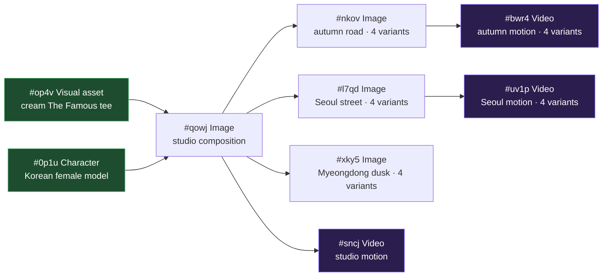

<p align="center">
  
</p>

<p align="center">
  <a href="#license"></a>
  
  
  
  
  
  
  
  
  
  
  
  
</p>

---

### ☕ Sponsor this project

<table align="center">
  <tr>
    <td align="center" width="50%">
      <a href="docs/assets/sponsor-qr-vn.jpg">
        
      </a><br/>
      <sub>📱 <b>Vietnam</b><br/>MoMo · VietQR · napas247</sub>
    </td>
    <td align="center" width="50%">
      <a href="docs/assets/sponsor-qr-binance.png">
        
      </a><br/>
      <sub>💰 <b>Binance Pay</b><br/>Crypto / cross-border</sub>
    </td>
  </tr>
</table>

<p align="center">
  🌍 <b>International (card):</b>
  <a href="https://ko-fi.com/crisnguyen95">
    
  </a>
</p>

<p align="center">
  <sub><i>(yes — I moved this up here on purpose. Was afraid nobody scrolls past the badges 😅)</i></sub>
</p>

---

<p align="center">
  <b>A local-only, single-user infinite-canvas workspace for AI media workflows.</b><br/>
  Compose characters, products, scenes, and videos as a directed graph. Drive generation through a Chrome extension that proxies requests to Google Flow (Veo 3.1 / GEM_PIX_2).<br/>
  Every node is reusable, every edge is a real data-dependency, every variant is independently regenerable.
</p>

> **⚠ Hard requirements — read this before cloning:**
>
> 1. **Google Flow plan: `Free`, `Pro`, or `Ultra`.** Pro and Ultra users
>    keep the existing paid-queue defaults (Veo 3.1 Fast / Quality,
>    GEM_PIX_2). **Free / trial users must enable
>    `Settings → Low-priority queue (free-tier compatible)`** —
>    everything (image, edit, video, Omni Flash) then routes through
>    Flow's 0-credit low-priority queue and the Veo i2v model auto-switches
>    to `veo_3_1_i2v_lite_low_priority` (Lite Low Priority). Expect
>    slower turnarounds when Flow is busy. Confirm your plan at
>    [labs.google/fx](https://labs.google/fx/tools/flow) before
>    installing.
> 2. **Chrome extension is mandatory.** All generation requests are
>    proxied through `extension/` (Chrome MV3) so the agent can ride
>    your authenticated Flow session + reCAPTCHA token. Without the
>    extension loaded and connected to `labs.google/fx/tools/flow`, the
>    `▶ Generate` button does nothing.
> 3. **One LLM CLI on `PATH` for auto-prompt / vision / planner.**
>    Flowboard ships a swappable provider layer — pick one in
>    `Settings → AI Providers`:
>
>    - **Claude Code** (default, recommended) —
>      [`@anthropic-ai/claude-code`](https://docs.claude.com/claude-code/install) ·
>      OAuth via your Claude subscription · fully tested in production.
>    - **Gemini CLI** — [`@google/gemini-cli`](https://github.com/google-gemini/gemini-cli) ·
>      OAuth via Google AI · tested live; ~15 s slower per call than
>      Claude due to subprocess cold-start.
>    - **OpenAI Codex** —
>      [`@openai/codex`](https://github.com/openai/codex) · OAuth via
>      ChatGPT Plus/Pro · provider class implemented + auto-detected
>      but **not yet smoke-tested end-to-end**; treat as beta.
>
>    Flowboard does not call any cloud LLM API directly — every
>    auto-prompt / vision / planner round-trip shells out to the CLI
>    you've connected, so the cost lives on your existing AI
>    subscription.

<p align="center">
  <a href="#why">Why</a> ·
  <a href="#showcase">Showcase</a> ·
  <a href="#how-it-works">How it works</a> ·
  <a href="#architecture">Architecture</a> ·
  <a href="#quickstart">Quickstart</a> ·
  <a href="#features">Features</a>
</p>

---

## Demo

<p align="center">
  <a href="docs/assets/flowboard-intro.mp4">
    
  </a><br/>
  <sub>End-to-end walkthrough — refs → composed image → multi-source i2v. Click for full-quality MP4.</sub>
</p>

---

## Why

E-commerce video creative is repetitive: same model, same product, many
scenes, many short clips. Building it by hand in a generic Veo / Imagen UI
means re-uploading the same character ref every time, re-typing the same
"young Korean woman in the cream cropped tee" prompt every time, and
losing track of which 4-variant generation came from which source still.

Flowboard treats the workflow as a graph:

- **Refs are nodes** — upload a character once, upload a product once.
- **Composed shots are nodes** — `(Character) + (Product) → Image`.
- **Videos are nodes** — `(Image) → Video` via i2v, with multi-source batch
  so a 4-variant image spawns 4 videos in one click.
- **Prompts are auto-synthesised** from upstream context (the configured
  LLM CLI's vision pass describes each ref → a downstream generator
  gets the brief spliced into a fashion-editorial prompt). Switch
  provider in `Settings → AI Providers`; defaults to Claude Code.

The result: one source-of-truth canvas for an entire campaign.

---

## Showcase

The graph below is a real export from a board in this project — two ref
nodes (`#op4v` product, `#0p1u` model) feeding three scene compositions
and three downstream videos. Every image and clip below was rendered by
the pipeline in this repo.

<p align="center">
  <br/>
  <sub>The actual canvas in the app: 2 refs (left) → studio composition <code>#qowj</code> (centre) → scene-variant images (autumn / Seoul / Myeongdong) → 3 video nodes with 4-up i2v variant grids (right).</sub>
</p>



### Layer 0 — references (one-time setup)

<table>
<tr>
<td align="center" width="50%">
  <br/>
  <sub><b>#op4v · Visual asset</b><br/>Cropped boxy short-sleeve tee in cream ribbed cotton with brown "The Famous" centre-chest embroidery.</sub>
</td>
<td align="center" width="50%">
  <br/>
  <sub><b>#0p1u · Character</b><br/>Studio portrait headshot, neutral closed-mouth expression — generated from gender + nationality presets, anchored for downstream identity consistency.</sub>
</td>
</tr>
</table>

### Layer 1 — composed studio shot

<p align="center">
  <br/>
  <sub><b>#qowj · Image</b> — auto-prompt from upstream briefs: "Editorial photo, model engaging the camera with direct eye contact, both hands tucked in pockets, knees-up framing, neutral studio backdrop." 4 pose-distinct variants generated in one batch.</sub>
</p>

### Layer 2 — environment-aware variants

The synth detects scene context from each new image's brief and switches
motion vocabulary (street / studio / café / outdoor). Same character + same
product, three different worlds:

<table>
<tr>
<td align="center" width="33%">
  <br/>
  <sub><b>#nkov</b> · autumn mountain road, traditional Korean pavilion, red maple foliage</sub>
</td>
<td align="center" width="33%">
  <br/>
  <sub><b>#l7qd</b> · Seoul street, food stalls, Korean signage</sub>
</td>
<td align="center" width="33%">
  <br/>
  <sub><b>#xky5</b> · Myeongdong dusk, red-canopied stalls, Olive Young signage</sub>
</td>
</tr>
</table>

### Layer 3 — image-to-video (Veo 3.1 i2v)

Camera is locked-off (e-commerce default — keeps the product fully framed
the whole clip); the model performs a **time-coded 2–3 beat editorial
pose-shift** within the 8 seconds. (GitHub renders MP4 inline only when
hosted on its CDN, so we ship looping GIFs in the README — full-quality
MP4s live in [`docs/assets/`](docs/assets/).)

<table>
<tr>
<td align="center" width="33%">
  <br/>
  <sub><b>#sncj</b> · studio motion · half-step → glance → hair-tuck<br/><a href="docs/assets/video-base.mp4">▶ MP4</a></sub>
</td>
<td align="center" width="33%">
  <br/>
  <sub><b>#bwr4</b> · autumn road · pivot → pocket → camera smirk<br/><a href="docs/assets/video-autumn.mp4">▶ MP4</a></sub>
</td>
<td align="center" width="33%">
  <br/>
  <sub><b>#uv1p</b> · Seoul daylight · half-step → over-shoulder glance → hand in pocket<br/><a href="docs/assets/video-seoul.mp4">▶ MP4</a></sub>
</td>
</tr>
</table>

> All three videos were synthesised from a single click each: the
> auto-prompt reads the upstream image's `aiBrief`, picks scene-matched
> motion vocab, and locks the camera to keep the cropped tee in frame for
> the full clip.

---

## How it works

The mental model — read this once and the rest of the UI is obvious.

### 1. Refs are nodes you set up once

Two node types act as **anchors** for the rest of the graph:

| Node | Purpose | How to populate |
|------|---------|-----------------|
| **Character** | A person whose identity you want to keep stable across many shots. | Generate from gender + nationality presets (Nam / Nữ × VN / JP / KR / CN / TH / US / FR), or upload your own portrait. The synth hard-anchors it to a frontal, closed-mouth, neutral-expression studio headshot — Veo i2v can't keep identity stable from a smiling-with-teeth source. |
| **Visual asset** | A product / garment / object that needs to appear in scenes. | Upload (file or URL) or generate from a prompt. Inline `Refine` button uses Flow's `edit_image` to iterate without losing the original. |

Each ref node gets an `aiBrief` automatically (the configured Vision
provider describes the image once, persists the description on the
node). Downstream auto-prompt walks upstream and pulls these briefs as
context. Toggle off in `Settings → AI Providers` if you'd rather
synthesise from typed prompts.

### 2. Composition is just connecting nodes

To build a composed image, drop an **Image** node and wire upstream refs
into it. Click `Generate` (or just press Enter with the prompt empty):

```
[Character #ujr1]  ───►
                        \
[Visual asset #sqpi] ───► [Image #target]
                        /
[Image #other-ref] ───►
```

All upstream `mediaId`s are fed to Flow as `IMAGE_INPUT_TYPE_REFERENCE`
inputs. The auto-prompt synth (`/api/prompt/auto-batch`) asks the
configured LLM to compose **N pose-distinct prompts** in a single
call when you ask for multiple variants — so 4 variants don't all
collapse to the same "hand-on-hip" stance. The prompt template is fashion-editorial style:
direct gaze, neutral closed-mouth, three-quarter angle, hand gesturing
toward the garment, knees-up framing.

### 3. Image → Video via Veo i2v

A **Video** node takes a single upstream Image. Connect it, click
`Generate`, pick:

- **Camera** = `Static` (default, e-commerce-safe — locked-off frame, no
  zoom or pan, product never crops out) or `Dynamic` (synth picks
  subtle dolly / pan based on scene).
- **Source variants** = checkbox per upstream variant + `All / None`
  bulk action. If the upstream image has 4 variants and you tick all 4,
  the dispatcher batches **one i2v op per variant** in a single Flow
  call — 4 source stills → 4 distinct videos.

The motion synth uses time-coded beats (`0–3s: …`, `3–6s: …`, `6–8s: …`)
so the model performs an editorial pose-shift sequence inside the 8 s
clip — never a frozen statue, never an open-mouth smile.

### 4. Auto-prompt is environment-aware

The synth reads the source still's `aiBrief` and switches motion
vocabulary based on detected scene:

| Scene type | Motion vocab |
|------------|-------------|
| Studio / plain backdrop | hand-on-hip, brush sleeve, head tilt, engage camera |
| Street / city / sidewalk | half-step forward, hair tuck, glance over shoulder, hand in pocket, smirk |
| Café / interior | sip from cup, lean back, glance toward window |
| Beach / nature / outdoor | hair flutter in breeze, slow exhale, look toward horizon |

A studio shot gets editorial poses; a NYC-street shot gets walk-and-glance
motion. No code branches — the LLM detects the keyword and picks the
matching vocab from the system prompt.

---

## Architecture

```
┌──────────────────────┐    ┌────────────────────┐    ┌──────────────────────┐
│  Chrome MV3 ext      │◄───┤  FastAPI agent     ├───►│  SQLite (storage/)   │
│  - content script    │ WS │  127.0.0.1:8101    │    │  Board, Node, Edge,  │
│  - injected MAIN     │ ws │  + worker queue    │    │  Request, Asset,     │
│  - CDN URL allow     │9223│  + WS server :9223 │    │  Plan, ChatMessage,  │
│  - Captcha bridge    │    │  + LLM CLI bridge  │    │  BoardFlowProject    │
└──────────────────────┘    └─────────┬──────────┘    └──────────────────────┘
        ▲                             │
        │                             ▼
        │                   ┌────────────────────┐
        └───── Google Flow  │  React + Vite      │
              labs.google   │  ReactFlow canvas  │
              (i2v / image) │  Zustand store     │
                            │  127.0.0.1:5173    │
                            └────────────────────┘
```

- **Frontend** — Vite + React 18 + ReactFlow 12 + Zustand 5 + TypeScript
  strict. Renders the infinite canvas, dialogs, sidebars. No direct
  calls to Google Flow.
- **Agent** — FastAPI + SQLModel + SQLite. Owns the board state, runs
  an in-process worker queue that proxies all generation requests
  through the extension, and shells out to the configured LLM CLI
  (Claude / Gemini / Codex — see *AI Providers* below) for vision +
  auto-prompt + planner synthesis.
- **Extension** — Chrome MV3. Lives on `labs.google/fx/tools/flow`,
  intercepts Flow's API calls (multimodal-fetch in MAIN world for the
  reCAPTCHA token), proxies them over a localhost WebSocket so the
  agent never has to touch the browser cookie jar directly.
- **Storage** — local-only. SQLite for graph + history, a
  `storage/media/` folder for cached image / video bytes (lazy-fetched
  from Flow's signed CDN URLs and re-served from the agent so they
  outlive the 1-hour signed URL TTL).

---

## Quickstart

### Requirements

| Dependency | Why |
|------------|-----|
| **Python 3.11** | Agent runtime (FastAPI + SQLModel) |
| **Node 20+** | Frontend dev server (Vite) |
| **Chrome / Chromium** | **Mandatory** — hosts the MV3 extension that proxies every Google Flow API call. The agent has zero direct path to Flow without it. |
| **One LLM CLI** on `PATH` | Vision describe + auto-prompt + planner. Pick one — defaults to **Claude Code** ([`@anthropic-ai/claude-code`](https://docs.claude.com/claude-code/install)); also supports **Gemini CLI** ([`@google/gemini-cli`](https://github.com/google-gemini/gemini-cli)) and **OpenAI Codex** ([`@openai/codex`](https://github.com/openai/codex), provider implemented but not yet smoke-tested). All use OAuth against your existing AI subscription — no API key needed. |
| **Google Flow plan** at [`labs.google/fx/tools/flow`](https://labs.google/fx/tools/flow) | **Free / Pro / Ultra all supported.** Pro and Ultra use the standard paid queues by default. Free / trial accounts must enable `Settings → Low-priority queue (free-tier compatible)` — every dispatch then routes through Flow's 0-credit low-priority queue (i2v uses `veo_3_1_i2v_lite_low_priority`, image gen still uses GEM_PIX_2 with the TIER_TWO envelope). Slower turnaround, but unblocks Flowboard end-to-end on the free tier. |

> **Windows:** Use [WSL2](https://learn.microsoft.com/en-us/windows/wsl/install). All commands assume a Unix shell.

### One-line setup (optional)

If you have `make` installed, the repo ships shortcut targets that wrap
Steps 2 + 3:

```bash
make install        # agent venv + frontend deps (uses uv if available, else pip)
make install-dev    # same, but adds ruff + pytest extras
make update         # upgrade agent + frontend deps in place
make agent          # run FastAPI on :8101
make frontend       # run Vite on :5173
```

`uv` is auto-detected (~10× faster installs). Install it once with
`curl -LsSf https://astral.sh/uv/install.sh | sh`, or skip it and the
Makefile falls back to stdlib `venv` + `pip`. Step 1 (loading the Chrome
extension) still has to be done manually.

### Step 1 — load the Chrome extension

```bash
git clone https://github.com/<your-fork>/flowboard.git
cd flowboard
```

1. Open `chrome://extensions/` → enable **Developer mode** (top-right).
2. Click **Load unpacked** → pick the `extension/` folder in this repo.
3. Open a tab to <https://labs.google/fx/tools/flow> and sign in.
4. The extension's icon should turn coloured once it captures a fresh
   Flow auth token (~5 s).

### Step 2 — start the agent

```bash
cd agent
python3.11 -m venv .venv
.venv/bin/pip install -r requirements.txt

# `--timeout-graceful-shutdown 2` keeps `--reload` snappy when you save
# a Python file — without it, uvicorn waits forever for the WS to drain.
.venv/bin/uvicorn flowboard.main:app --reload --port 8101 \
  --timeout-graceful-shutdown 2
```

Smoke-test:

```bash
curl http://127.0.0.1:8101/api/health
# {"ok":true,"extension_connected":true,"ws_stats":{"connected":true,"flow_key_present":true,...}}
```

### Step 3 — start the frontend

```bash
cd frontend
npm install
npm run dev
# → http://localhost:5173
```

Open the URL. The first board ("Untitled") auto-creates if the DB is
empty. Add a Character node, generate it, drop a Visual asset, drop an
Image, wire them up, click **▶ Generate** — the full demo above is
about 15 minutes of clicking.

### Run tests

```bash
# Agent
cd agent && .venv/bin/python -m pytest -q
# 333 passed

# Frontend
cd frontend && npx tsc -p . --noEmit && npx vite build
```

---

## Features

### Ref-style nodes

- **Character** — generate via gender + nationality preset chips, or
  upload your own headshot. Hard-anchored to a frontal, closed-mouth,
  neutral-expression portrait so Veo i2v keeps identity stable across
  every downstream clip.
- **Visual asset** — upload (file / URL) or generate. Refine in-place
  with a different prompt (Flow `edit_image`, BASE_IMAGE preserved,
  optional reference list).

### Composition nodes

- **Image** — multi-ref aware. Connect any number of upstream
  characters, visual assets, or other images; all of them flow in as
  Flow's `IMAGE_INPUT_TYPE_REFERENCE` inputs.
  - 1–4 variants per gen, each with its own pose-distinct prompt
    (the LLM rotates through an 8-stance pool per variant — never two
    "hand-on-hip" variants in the same gen).
  - Default aspect ratio inherits from upstream node; mismatched
    upstream aspects fall back to 9:16.
- **Storyboard** — sequenced 1–8 narrative shots in one node. The
  planner LLM emits per-beat prompts AND a continuity tree: each beat
  declares whether it's a fresh root (`gen_image`) or continues from
  an earlier beat (`edit_image` from that beat's mediaId). Roots
  dispatch in parallel batches of 4; continuations BFS through the
  tree, siblings parallel. Refs from upstream edges apply to every
  shot. Failed shots stay `partial` and can be retried per-tile —
  blocked descendants surface a 🔒 until their parent is retried.
  Useful for unbox → try-on → going-out arcs, scene chains, and
  e-commerce shot lists.
- **Video** — image-to-video via Veo. **Multi-source i2v**: a 4-variant
  upstream image dispatches a single batch with one item per variant →
  one video per source. Or pick a subset (toggleable thumbnails +
  All / None bulk action).
  - Camera = `Static` (locked-off, e-commerce default) or `Dynamic`
    (synth picks dolly / pan / micro-shift to fit the scene).
  - Motion synth uses time-coded beats so the model performs an
    editorial 2–3 pose-shift sequence inside the 8s clip — never a
    frozen statue.

### Auto-prompt synthesis

- Vision describes each new asset (configured CLI's multimodal
  attachment path — `@<path>` for Claude / Gemini, `--image` for Codex
  when available) → saved as `aiBrief` on the node.
- Downstream gen with empty prompt → `/api/prompt/auto` walks upstream
  edges, gathers briefs, asks the configured LLM to compose a prompt
  that matches the scene + showcases the product.
- For multi-variant gens, `/api/prompt/auto-batch` returns N
  pose-distinct prompts in a single LLM call.
- **Vision toggle** in `Settings → AI Providers`: when OFF, the
  synthesiser falls back to each upstream node's typed `prompt`
  instead of a vision-derived brief. Manual upload paths still run
  vision automatically (the user explicitly added bytes) — only the
  gen-completion auto-brief is gated.

### AI Providers (multi-LLM)

A **🤖 Provider** chip in the top-right toolbar opens a dialog where
you switch which LLM powers Flowboard. One provider serves all three
features (Auto-Prompt / Vision / Planner) — switching is one decision,
not three. Per-feature test buttons run a small ping per feature and
gate the **Apply changes** button until all three pass green, so you
never apply a switch that's silently broken.

| Provider | Auth | Status |
|---|---|---|
| **Claude Code** | OAuth via `claude` CLI · Anthropic browser sign-in | ✅ Default · production-tested |
| **Gemini CLI** | OAuth via `gemini` CLI · Google AI Ultra plan | ✅ Tested · ~15 s slower than Claude |
| **OpenAI Codex** | OAuth via `codex` CLI · ChatGPT Plus/Pro | ⚠ Provider implemented but not yet smoke-tested |

Backend keeps a Grok REST provider class for power users who edit
`~/.flowboard/secrets.json` directly, but the UI doesn't surface it
because xAI hasn't shipped an end-user CLI.

### Activity feed

A **🔔 bell** sits in the toolbar next to the AI Provider chip. Click
it to see every backend operation in DESC order: gen image / gen
video / edit image / auto-prompt / vision / planner — each with its
status pill (✓ done · ⟳ running · ✗ failed) and how long it ran. Click
a row to open a detail modal with the full input params, output
result, and error JSON (with copy buttons), so you can diagnose a
failed gen without tailing agent logs.

The bell badge counts running + recently-failed-unread items, with a
red tint when any failure is unread. Polling is 5 s while the dropdown
is open, 30 s while closed, and pauses when the tab is backgrounded.

### Workflow ergonomics

- **Drop-add popover** — drag an edge into empty canvas, popover at the
  drop point with `Image` / `Video` quick-add → new node + auto-wired
  edge.
- **Easy edge editing** — click an edge to select (accent ring + glow),
  Backspace / Delete to remove. 24 px transparent hit-slop so edges are
  forgiving to grab.
- **Clone variant** — `New variant +` in the result viewer creates a
  sibling node with identical upstream connections, prefills the
  prompt, opens the gen dialog.
- **Project sidebar** — multiple boards on the same agent, each with
  its own Flow project mapping. Rename / delete with cascade (clears
  all child rows: nodes, edges, requests, assets, plans, runs).

---

## Repo layout

```
agent/                  FastAPI service (Python 3.11)
  flowboard/
    routes/             HTTP endpoints (boards, nodes, edges, requests,
                        upload, vision, prompt, plans, llm, activity, …)
    services/           Flow SDK, prompt synth, vision describe,
                        pipeline executor, activity logger
      llm/              Multi-LLM provider layer (registry, secrets,
                        Claude / Gemini / OpenAI Codex / Grok)
      claude_cli.py     Subprocess detail behind ClaudeProvider
    worker/             In-process queue (gen_image, gen_video,
                        edit_image, upload_image)
    db/                 SQLModel definitions
  tests/                333+ pytest tests

frontend/               Vite + React + ReactFlow
  src/
    canvas/             Board.tsx, NodeCard.tsx, AddNodePalette.tsx
    components/
      activity/         ActivityBell + dropdown + detail modal
      settings/         AiProvidersSection + ProviderCard + setup modal
      AiProviderBadge.tsx · AiProviderDialog.tsx · GenerationDialog · ResultViewer · ProjectSidebar · ChatSidebar · Toolbar · Toaster
    store/              Zustand: board, generation, pipeline, settings
    api/                client.ts, autoBrief.ts

extension/              Chrome MV3 (content script + injected MAIN)
docs/                   Static assets (this README, screenshots, demo media)
storage/                Local cache + SQLite (gitignored)
```

---

## Status

Personal local-only tool. **377 / 377 tests passing** (agent), tsc
clean (frontend). Caveats:

- ⚠ **Google Flow plan: free / Pro / Ultra all supported.** Pro and
  Ultra users keep paid-queue defaults. Free / trial users must enable
  `Settings → Low-priority queue (free-tier compatible)` — every
  dispatch then routes through Flow's 0-credit low-priority queue and
  Veo i2v auto-switches to Lite Low Priority. Free-tier support is
  best-effort and rate-limited by Flow's low-priority queue policy
  (slower turnaround when Flow is busy, occasional `quota_exceeded`).
- ⚠ **Chrome extension must be loaded and connected.** The agent does
  not talk to Flow directly — all i2v / image / edit requests are
  proxied through `extension/` over a localhost WebSocket. No
  extension → no generation.
- ⚠ HMAC-secured WS (`X-Callback-Secret` per agent boot) — single
  loopback only, not multi-user.
- ⚠ Google Flow rate limits still apply on every tier (paid quota for
  Pro / Ultra; low-priority queue depth for free).
- ⚠ Veo / Imagen content filters
  (`PUBLIC_ERROR_PROMINENT_PEOPLE_FILTER_FAILED`,
  `PUBLIC_ERROR_AUDIO_FILTERED`) — surfaced verbatim in the activity
  feed + failed-request error so the user can diagnose / iterate.
- ⚠ Auto-prompt + vision + planner require **one** LLM CLI on `PATH`
  (Claude Code recommended; Gemini CLI tested; OpenAI Codex provider
  implemented but not yet smoke-tested). Without any CLI, the
  `Generate` button still works if you type your own prompt — only
  the auto-prompt-from-empty path is unavailable.

## Related

- [`crisng95/flowkit`](https://github.com/crisng95/flowkit) — the same
  Chrome-extension-bridge approach to Google Flow, but for **YouTube
  story videos** (multi-scene, narration, thumbnails). Flowboard
  borrows the bridge architecture.

## License

MIT (proposed — license file pending).

---

## Credits

Generated media in this README was produced through the pipeline using
[Google Flow](https://labs.google/flow). Auto-prompt + vision synthesis
defaults to [Claude](https://claude.ai) via the local CLI; multi-LLM
support adds Google's [Gemini CLI](https://github.com/google-gemini/gemini-cli)
and OpenAI's [Codex CLI](https://github.com/openai/codex) as alternative
providers — pick one in `Settings → AI Providers`.

---

## Community & Support

<p align="center">
  <a href="https://www.facebook.com/groups/flowkit.flowboard.community">
    
  </a>
</p>

The shared community for both **FlowKit** and **Flowboard**. Drop in to:

- Post the shots and clips you've generated
- Share node-graph patterns, vibe presets, and prompt recipes that work for you
- Ask for help when an output isn't matching what you imagined
- Request features and report bugs you've hit in the wild
- Trade tips on Google Flow plan limits, Veo i2v behaviour, and LLM CLI setup (Claude / Gemini / Codex)

→ **[facebook.com/groups/flowkit.flowboard.community](https://www.facebook.com/groups/flowkit.flowboard.community)**
